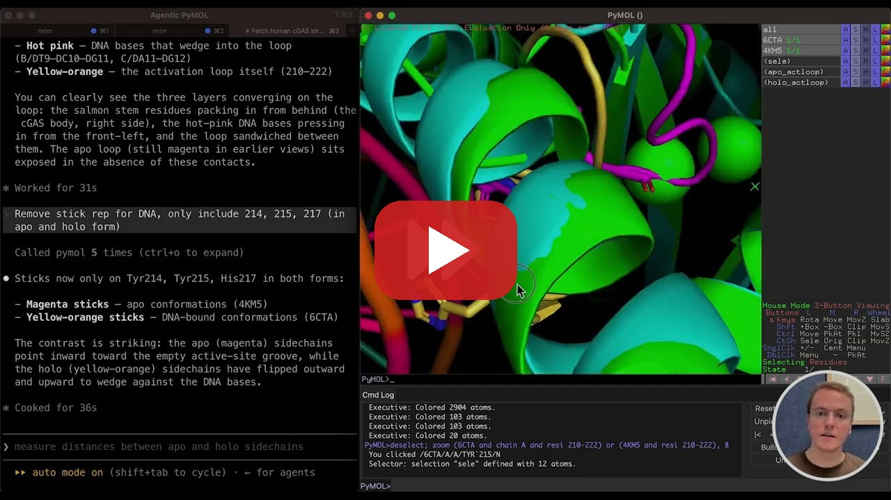
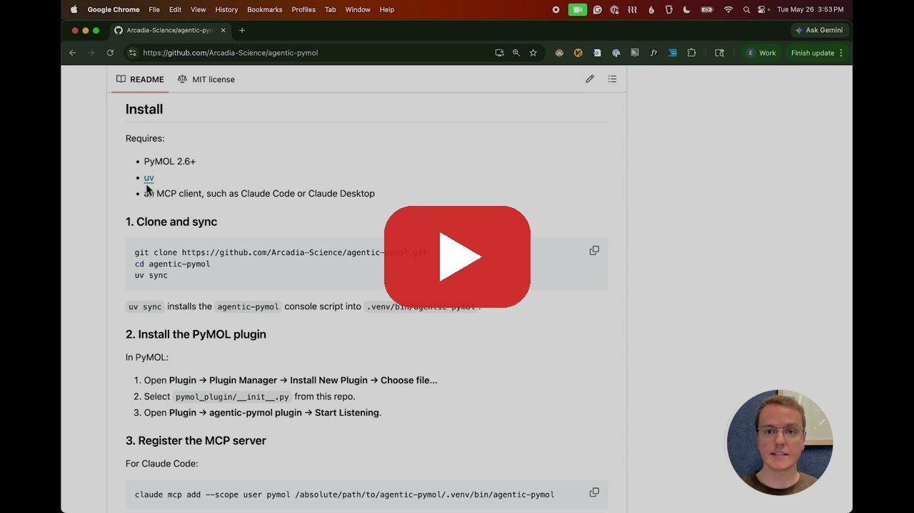
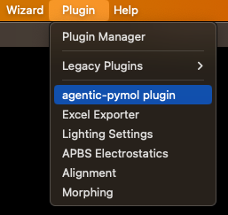

# Agentic PyMOL

https://github.com/user-attachments/assets/43524828-0fcc-44e5-bcd6-c912e7f865b1

## Description

A lightweight Model Context Protocol (MCP) server that exposes PyMOL as a typed tool surface for general-purpose agents.

Use it with Claude Code, Claude Desktop, Codex, or any MCP-compatible client to let your agent control an open PyMOL session, inspect molecular structures, run PyMOL-native analyses, and render what it sees.

Agentic PyMOL is not an embedded chatbot and not a molecular workbench. It is a small bridge between a capable agent and the PyMOL session you already use.

## What you can do

Ask your agent to use PyMOL directly:

```text
* Fetch ubiquitin, show it as cartoon, color by secondary structure, and render a PNG.
* Create a table of residues that are in contact with DNA in the DNA-binding protein 6EDC.
* Load these two structures, align chain A, report the RMSD, and show the regions that moved the most.
* Which of these 10 binders trigger a conformational shift in the target activation loop?
```

For a brief showcase of abilities, see this 6-minute demonstration of how you can use Agentic PyMOL to conduct meaningful structural analysis with natural language:

[](https://www.youtube.com/watch?v=0peLwtqQX7I)

## Design goals

- **Use the PyMOL you already have.** Works with your existing PyMOL installation; PyMOL 2.6+ is supported.
- **No insular chatbot.** PyMOL is exposed to your general-purpose agent rather than wrapping PyMOL in its own chat interface.
- **Two-way communication.** The agent can manipulate the live PyMOL session and read structured information back out for reasoning, answers, and downstream work.
- **Typed over textual.** Return objects, chains, coordinates, distances, RMSDs, views, sequences, and errors as data -- not just “succeeded.”
- **PyMOL-native first.** Stay focused on visualization, selection logic, geometry, alignments, rendering, and session inspection.
- **Lightweight and composable.** Do not bundle docking, sequence search, conservation analysis, prediction services, or external biology APIs; let other tools handle those jobs.

## Install

For a video walkthrough of the setup, watch this explanation:

[](https://youtu.be/xhaW-id0eu0)

Requires:

* PyMOL 2.6+
* [uv](https://docs.astral.sh/uv/)
* an MCP client, such as Claude Code or Claude Desktop

### 1. Clone and sync

```bash
git clone https://github.com/Arcadia-Science/agentic-pymol.git
cd agentic-pymol
uv sync
```

`uv sync` installs the `agentic-pymol` console script into `.venv/bin/agentic-pymol`.

### 2. Install the PyMOL plugin

In PyMOL:

1. Open **Plugin → Plugin Manager → Install New Plugin → Choose file…**
2. Select `pymol_plugin/__init__.py` from this repo.
3. Open **Plugin → agentic-pymol plugin → Start Listening**.

### 3. Register the MCP server

For Claude Code:

```bash
claude mcp add --scope user pymol /absolute/path/to/agentic-pymol/.venv/bin/agentic-pymol
```

> [!NOTE]
> Using a different MCP client? Please [open a GitHub issue](https://github.com/Arcadia-Science/agentic-pymol/issues), or even better, send a [pull request](https://github.com/Arcadia-Science/agentic-pymol/pulls) adding the registration instructions for your client.

**You've successfully installed Agentic PyMOL**. See the next section for how to use it.

## How to use

Before your agent can control PyMOL, you must tell the plugin to start listening. **You have to do this each PyMOL session**. In PyMOL, open *Plugin → agentic-pymol plugin → Start Listening*. This opens the socket that the MCP server connects to.



> [!NOTE]
> Currently Agentic PyMOL supports **one** PyMOL session bridged to **one** MCP server. Multiple agent conversations can talk to that single PyMOL concurrently, but a single MCP server doesn't currently see more than one PyMOL session at a time. Multi-session support is a candidate future feature. Please open an issue if it would help your workflow.

The plugin defaults to port 9877. You can choose a different port during the "start listening" dialog box in the PyMOL plugin, and setting the MCP server's `PYMOL_MCP_PORT` env var to match. For example, using Claude Code:

```bash
$ export PYMOL_MCP_PORT=9870
$ claude
```

You can now communicate with PyMOL through your LLM. Test it out:

```text
Fetch ubiquitin and color by secondary structure
```

## Similar projects

Agentic PyMOL is not the first PyMOL/LLM integration. Agentic PyMOL is intentionally narrow: a lightweight, typed MCP bridge to the PyMOL installation you already use. These projects explore nearby ideas with different emphases.

- [`vrtejus/pymol-mcp`](https://github.com/vrtejus/pymol-mcp) - Early demonstrator of the core value of connecting PyMOL to LLM agents through MCP. Agentic PyMOL builds on that idea with typed tool outputs, structured session readback, and shared-secret authentication.
- [MCPymol](https://github.com/chemrich/MCPymol) - a PyMOL MCP server that leverages the MCP as a thin command tunnel to carry out specific visualization-oriented workflows. In comparison, Agentic PyMOL is focused on supporting a lightweight and unopinionated tool surface that returns structured data to the LLM instead of simple "command succeeded" messages.
- [`nagarh/pymol-claude-code`](https://github.com/nagarh/pymol-claude-code) - a compact Claude Code-only MCP that controls PyMOL through its XML-RPC mode (`pymol -R`) that requires launching PyMOL from the command line. This shares the goal of giving agents live access to PyMOL, but opts for just three MCP tools (`run_command`, `run_python`, `pymol_get`). In contrast, Agentic PyMOL surfaces discoverable tools with structured readback.
- [ChatMol](https://chatmol.github.io/ChatMol/) - a broader molecular-design assistant with a PyMOL plugin, PyMOL skill, Streamlit interface, Python package, and copilot-style workflows. It is closer to a molecular-agent environment than a bridge between your existing LLM agent and PyMOL. Creates an insular environment.
- [`ravishar313/PyMolAI`](https://github.com/ravishar313/PyMolAI) - an AI-oriented fork of open-source PyMOL with a Qt chat panel, internal PyMOL tools, model-provider integration, and optional OpenBio tools. Creates an insular environment.
- [`pymol-agent-bridge`](https://github.com/ANaka/pymol-agent-bridge) - an interesting MCP-less socket bridge that lets terminal-capable agents send Python/PyMOL commands to a live PyMOL session. `pymol-agent-bridge` is a CLI/library bridge.

## How to cite

If you use/reference this tool in your research, please cite the following work:

[Agentic PyMOL: Structural analysis in PyMOL through natural language](https://thestacks.org/publications/resource-agentic-pymol/)

```bib
@article{Golden2026Agentic,
	author = {Golden, James R. and Kiefl, Evan},
	journal = {The Stacks},
	doi = {10.57844/arcadia-gsbx-phd2},
	year = {2026},
	month = {jun 2},
	publisher = {The Stacks},
	title = {Agentic {PyMOL}: Structural analysis in {PyMOL} through natural language},
	url = {https://thestacks.org/publications/resource-agentic-pymol/v1/v1},
}
```
